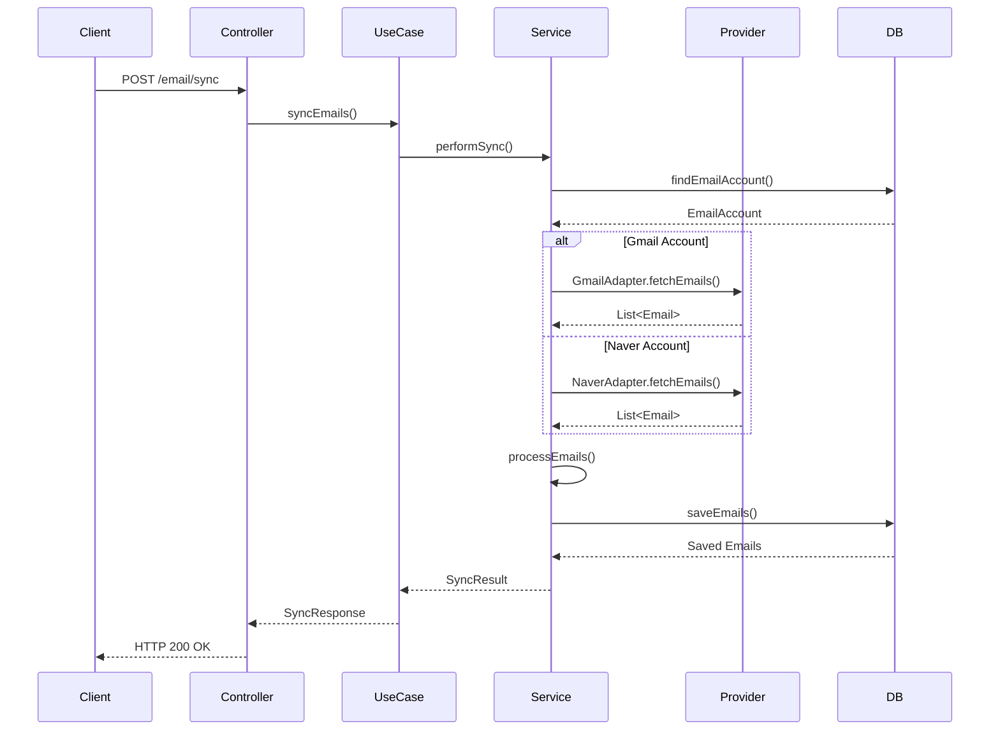
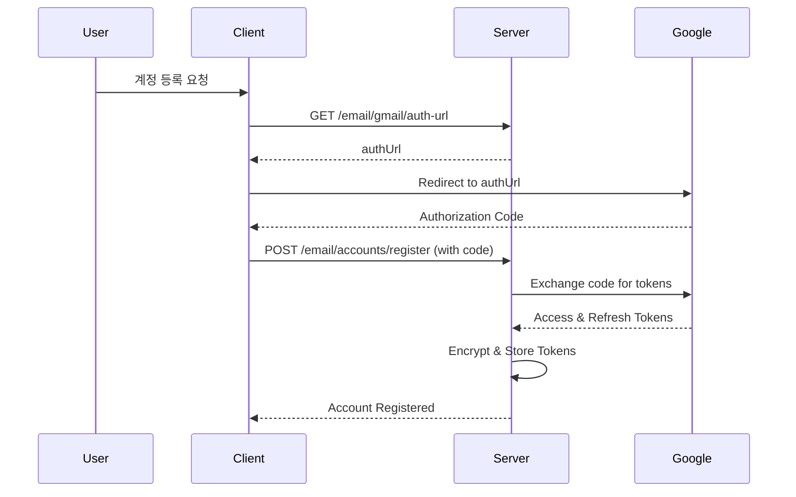
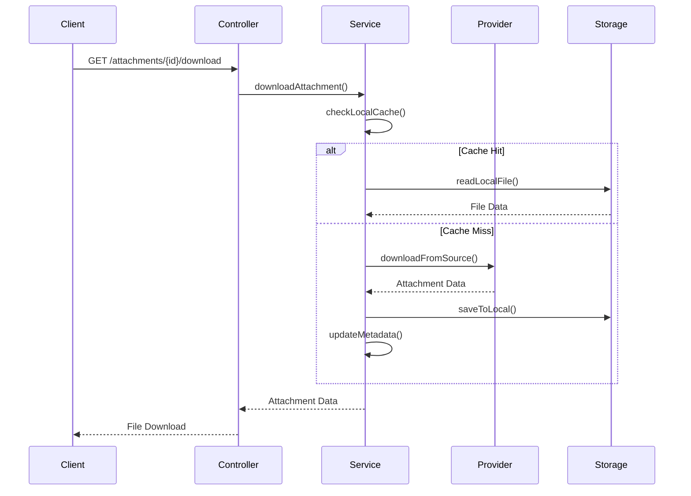
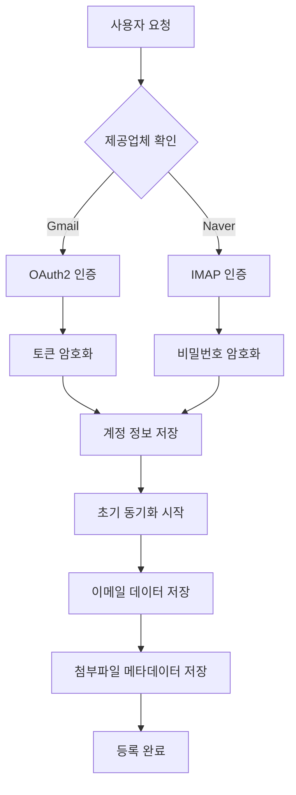
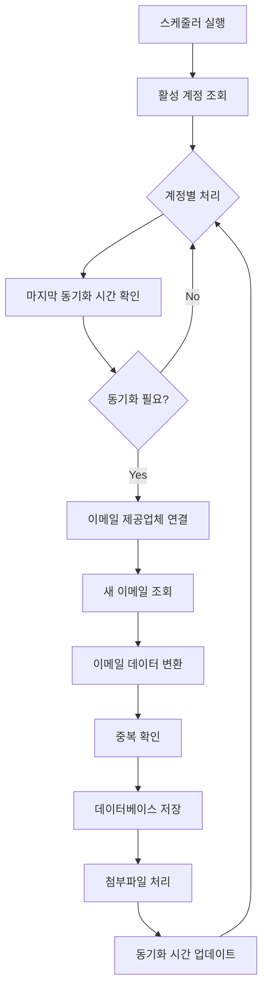

# 📧 Email System Logic Documentation

## 📋 목차
- [시스템 개요](#시스템-개요)
- [아키텍처 구조](#아키텍처-구조)
- [이메일 동기화 프로세스](#이메일-동기화-프로세스)
- [인증 및 보안](#인증-및-보안)
- [스케줄링 시스템](#스케줄링-시스템)
- [첨부파일 처리](#첨부파일-처리)
- [데이터 플로우](#데이터-플로우)
- [에러 처리 및 복구](#에러-처리-및-복구)

## 시스템 개요

Whale API Server의 이메일 관리 시스템은 **Hexagonal Architecture (Clean Architecture)** 기반으로 설계된 통합 이메일 관리 솔루션입니다.

### 🎯 주요 목표
- **1개 Naver Mail + 2개 Gmail 계정** 통합 관리
- **실시간 이메일 동기화** 및 자동 스케줄링
- **보안성**: 모든 인증 정보 암호화 저장
- **확장성**: 새로운 이메일 제공업체 쉽게 추가 가능
- **성능**: 비동기 처리 및 효율적인 데이터 관리

### 🏗️ 지원 기능
- 이메일 계정 등록 및 관리
- 실시간 이메일 동기화
- 첨부파일 다운로드 및 관리
- 자동 스케줄링 (동기화, 토큰 갱신, 정리)
- RESTful API 제공

### 🔧 기술 스택
- **Backend**: Spring Boot 3.x + Kotlin
- **Database**: PostgreSQL + JPA/Hibernate
- **Authentication**: OAuth2 (Gmail) + IMAP (Naver)
- **Security**: AES-256 암호화
- **Scheduling**: Spring @Scheduled + @Async
- **Architecture**: Hexagonal Architecture (Clean Architecture)

## 아키텍처 구조

### Hexagonal Architecture 적용

```
┌─────────────────────────────────────────────────────────────┐
│                    Adapter Layer (Input)                    │
├─────────────────────────────────────────────────────────────┤
│  Web Controllers  │  Schedulers  │  Event Handlers         │
│  - EmailController │ - EmailSync  │ - OAuth Callback        │
│  - AccountController│ - TokenRefresh│                        │
│  - AttachmentController│ - Cleanup │                        │
└─────────────────────────────────────────────────────────────┘
                              │
┌─────────────────────────────────────────────────────────────┐
│                   Application Layer                         │
├─────────────────────────────────────────────────────────────┤
│           Use Cases (Input Ports)                          │
│  - RegisterEmailAccountUseCase                             │
│  - GetEmailUseCase                                         │
│  - SyncEmailUseCase                                        │
│                                                            │
│           Services                                         │
│  - EmailAccountService                                     │
│  - EmailSyncService                                        │
│  - EmailAttachmentService                                  │
└─────────────────────────────────────────────────────────────┘
                              │
┌─────────────────────────────────────────────────────────────┐
│                    Domain Layer                             │
├─────────────────────────────────────────────────────────────┤
│  Domain Models:                                            │
│  - EmailAccount  - Email  - EmailAttachment               │
│  - EmailProvider - EmailFolder                            │
│                                                            │
│  Domain Services:                                          │
│  - EncryptionService                                       │
└─────────────────────────────────────────────────────────────┘
                              │
┌─────────────────────────────────────────────────────────────┐
│                 Adapter Layer (Output)                     │
├─────────────────────────────────────────────────────────────┤
│  Persistence    │  External APIs  │  Infrastructure        │
│  - JPA Entities │ - Gmail API     │ - Encryption           │
│  - Repositories │ - Naver IMAP    │ - File Storage         │
│  - QueryDSL     │ - OAuth2        │ - Scheduling           │
└─────────────────────────────────────────────────────────────┘
```

### 주요 컴포넌트

#### Input Ports (Use Cases)
- `RegisterEmailAccountUseCase`: 이메일 계정 등록
- `GetEmailUseCase`: 이메일 조회
- `SyncEmailUseCase`: 이메일 동기화

#### Output Ports
- `SaveEmailAccountOutput`: 계정 저장
- `FindEmailAccountOutput`: 계정 조회
- `GmailProviderOutput`: Gmail API 연동
- `NaverMailProviderOutput`: Naver IMAP 연동

#### Adapters
- **Persistence Adapters**: JPA 기반 데이터 저장
- **External Adapters**: Gmail API, Naver IMAP 연동
- **Web Adapters**: REST API 컨트롤러

## 이메일 동기화 프로세스

### 1. 동기화 플로우



### 2. 동기화 전략

#### 증분 동기화 (Incremental Sync)
- **기본 동기화 방식**: 마지막 동기화 이후 변경된 이메일만 가져옴
- **성능 최적화**: 네트워크 트래픽 및 처리 시간 최소화
- **구현**: `lastSyncDate` 기준으로 필터링

#### 전체 동기화 (Full Sync)
- **초기 동기화**: 계정 등록 시 또는 오랜 기간 동기화되지 않은 경우
- **복구 동기화**: 데이터 불일치 발생 시
- **스케줄링**: 매일 새벽 2시 자동 실행

### 3. 동기화 최적화

#### 배치 처리
```kotlin
// 대용량 이메일 처리를 위한 배치 처리
fun syncEmailsInBatches(emails: List<Email>, batchSize: Int = 100) {
    emails.chunked(batchSize).forEach { batch ->
        processBatch(batch)
        // 메모리 정리 및 DB 커넥션 관리
    }
}
```

#### 비동기 처리
```kotlin
@Async
@Scheduled(fixedRate = 30 * 60 * 1000) // 30분마다
fun syncAllActiveAccounts() {
    val activeAccounts = findEmailAccountOutput.findAllActive()
    
    activeAccounts.forEach { account ->
        CompletableFuture.supplyAsync {
            syncEmailUseCase.syncEmails(account.userId, account.identifier)
        }.exceptionally { throwable ->
            logger.error("Sync failed for account: ${account.identifier}", throwable)
            null
        }
    }
}
```

## 인증 및 보안

### 1. Gmail OAuth2 인증

#### 인증 플로우


#### 토큰 관리
```kotlin
data class GmailTokens(
    val accessToken: String,      // 1시간 유효
    val refreshToken: String,     // 영구 유효 (갱신 가능)
    val expiryTime: OffsetDateTime,
    val scope: List<String>
)

// 토큰 자동 갱신
@Scheduled(cron = "0 0 * * * *") // 매시간
fun refreshExpiredTokens() {
    val expiringAccounts = findAccountsWithExpiringTokens(
        provider = EmailProvider.GMAIL,
        expiryThresholdHours = 1
    )
    
    expiringAccounts.forEach { account ->
        try {
            val newTokens = gmailProviderOutput.refreshAccessToken(account.refreshToken)
            updateAccountTokens(account, newTokens)
        } catch (e: Exception) {
            handleTokenRefreshFailure(account, e)
        }
    }
}
```

### 2. Naver IMAP 인증

#### 앱 비밀번호 사용
```kotlin
data class NaverCredentials(
    val emailAddress: String,
    val appPassword: String,    // Naver 앱 비밀번호
    val imapHost: String = "imap.naver.com",
    val imapPort: Int = 993,
    val smtpHost: String = "smtp.naver.com",
    val smtpPort: Int = 587
)

// IMAP 연결
fun connectToNaver(credentials: NaverCredentials): Store {
    val props = Properties().apply {
        put("mail.store.protocol", "imaps")
        put("mail.imaps.host", credentials.imapHost)
        put("mail.imaps.port", credentials.imapPort)
        put("mail.imaps.ssl.enable", "true")
    }
    
    val session = Session.getInstance(props)
    val store = session.getStore("imaps")
    store.connect(credentials.emailAddress, credentials.appPassword)
    
    return store
}
```

### 3. 데이터 암호화

#### 민감 정보 암호화
```kotlin
@Service
class EncryptionService(
    @Value("\${email.encryption.secret-key}")
    private val secretKey: String
) {
    private val cipher = Cipher.getInstance("AES/GCM/NoPadding")
    private val keySpec = SecretKeySpec(secretKey.toByteArray(), "AES")
    
    fun encrypt(plainText: String): String {
        cipher.init(Cipher.ENCRYPT_MODE, keySpec)
        val encryptedBytes = cipher.doFinal(plainText.toByteArray())
        return Base64.getEncoder().encodeToString(encryptedBytes)
    }
    
    fun decrypt(encryptedText: String): String {
        cipher.init(Cipher.DECRYPT_MODE, keySpec)
        val decryptedBytes = cipher.doFinal(Base64.getDecoder().decode(encryptedText))
        return String(decryptedBytes)
    }
}
```

## 스케줄링 시스템

### 1. 스케줄러 구성

#### EmailSyncScheduler
```kotlin
@Scheduler
class EmailSyncScheduler {
    
    @Async
    @Scheduled(fixedRate = 30 * 60 * 1000) // 30분마다
    fun syncAllActiveAccounts() {
        // 모든 활성 계정 동기화
    }
    
    @Async
    @Scheduled(fixedRate = 10 * 60 * 1000) // 10분마다
    fun syncStaleAccounts() {
        // 오래된 계정 우선 동기화
    }
    
    @Async
    @Scheduled(cron = "0 0 2 * * *") // 매일 새벽 2시
    fun performDeepSync() {
        // 전체 심층 동기화
    }
}
```

#### TokenRefreshScheduler
```kotlin
@Scheduler
class TokenRefreshScheduler {
    
    @Async
    @Scheduled(cron = "0 0 * * * *") // 매시간
    fun refreshExpiredTokens() {
        // 만료된 토큰 갱신
    }
    
    @Async
    @Scheduled(cron = "0 0 */6 * * *") // 6시간마다
    fun monitorTokenHealth() {
        // 토큰 상태 모니터링
    }
    
    @Async
    @Scheduled(cron = "0 0 3 * * SUN") // 매주 일요일 새벽 3시
    fun weeklyTokenCleanup() {
        // 주간 토큰 정리
    }
}
```

#### AttachmentCleanupScheduler
```kotlin
@Scheduler
class AttachmentCleanupScheduler {
    
    @Async
    @Scheduled(cron = "0 0 4 * * *") // 매일 새벽 4시
    fun cleanupOldAttachments() {
        // 30일 이상 된 첨부파일 정리
    }
    
    @Async
    @Scheduled(cron = "0 0 5 * * SUN") // 매주 일요일 새벽 5시
    fun weeklyAttachmentCleanup() {
        // 90일 이상 된 첨부파일 정리
    }
}
```

### 2. 스케줄링 전략

#### 우선순위 기반 동기화
```kotlin
fun prioritizeAccounts(accounts: List<EmailAccount>): List<EmailAccount> {
    return accounts.sortedWith(compareBy<EmailAccount> { account ->
        when {
            account.lastSyncDate == null -> 0 // 최우선: 한 번도 동기화 안 됨
            account.lastSyncDate!!.isBefore(OffsetDateTime.now().minusHours(24)) -> 1 // 24시간 이상
            account.lastSyncDate!!.isBefore(OffsetDateTime.now().minusHours(6)) -> 2 // 6시간 이상
            else -> 3 // 최근 동기화됨
        }
    }.thenBy { it.lastSyncDate })
}
```

#### 에러 처리 및 재시도
```kotlin
@Retryable(
    value = [Exception::class],
    maxAttempts = 3,
    backoff = Backoff(delay = 1000, multiplier = 2.0)
)
fun syncWithRetry(account: EmailAccount) {
    try {
        syncEmailUseCase.syncEmails(account.userId, account.identifier)
    } catch (e: Exception) {
        logger.error("Sync failed for account: ${account.identifier}", e)
        throw e
    }
}
```

## 첨부파일 처리

### 1. 첨부파일 다운로드 플로우



### 2. 첨부파일 저장 전략

#### 로컬 저장소 구조
```
/app/email/attachments/
├── 2024/
│   ├── 01/
│   │   ├── 01/
│   │   │   ├── {attachment_id}_{filename}
│   │   │   └── ...
│   │   └── ...
│   └── ...
└── ...
```

#### 메타데이터 관리
```kotlin
data class EmailAttachment(
    val identifier: UUID,
    val emailIdentifier: UUID,
    val attachmentId: String,        // 원본 시스템의 첨부파일 ID
    val filename: String,
    val mimeType: String?,
    val sizeBytes: Long?,
    val isInline: Boolean,
    val contentId: String?,
    val localFilePath: String?,      // 로컬 저장 경로
    val createdDate: OffsetDateTime,
    val modifiedDate: OffsetDateTime
)
```

### 3. 첨부파일 정리 정책

#### 자동 정리 규칙
```kotlin
fun cleanupOldAttachments(daysOld: Int = 30) {
    val cutoffDate = OffsetDateTime.now().minusDays(daysOld.toLong())
    val oldAttachments = findEmailAttachmentOutput.findOldAttachments(cutoffDate)
    
    oldAttachments.forEach { attachment ->
        // 로컬 파일 삭제
        deleteLocalFile(attachment.localFilePath)
        
        // 메타데이터에서 로컬 경로 제거 (재다운로드 가능하도록)
        val updatedAttachment = attachment.copy(
            localFilePath = null,
            modifiedDate = OffsetDateTime.now()
        )
        saveEmailAttachmentOutput.save(updatedAttachment)
    }
}
```

## 데이터 플로우

### 1. 이메일 등록 플로우



### 2. 이메일 동기화 플로우



## 에러 처리 및 복구

### 1. 에러 분류 및 처리

#### 네트워크 에러
```kotlin
@Retryable(
    value = [ConnectException::class, SocketTimeoutException::class],
    maxAttempts = 3,
    backoff = Backoff(delay = 2000, multiplier = 2.0)
)
fun handleNetworkError() {
    // 네트워크 연결 재시도
}
```

#### 인증 에러
```kotlin
fun handleAuthenticationError(account: EmailAccount, exception: Exception) {
    when (exception) {
        is OAuth2AuthenticationException -> {
            // Gmail 토큰 갱신 시도
            refreshGmailToken(account)
        }
        is AuthenticationFailedException -> {
            // Naver 계정 비활성화
            deactivateAccount(account, "Authentication failed")
        }
    }
}
```

#### 데이터 에러
```kotlin
fun handleDataError(email: Email, exception: Exception) {
    logger.error("Data processing error for email: ${email.messageId}", exception)
    
    // 에러 이메일을 별도 테이블에 저장하여 나중에 재처리
    saveFailedEmail(email, exception.message)
}
```

### 2. 복구 메커니즘

#### 자동 복구
```kotlin
@Scheduled(cron = "0 0 1 * * *") // 매일 새벽 1시
fun performHealthCheck() {
    // 1. 비활성화된 계정 중 복구 가능한 계정 확인
    val inactiveAccounts = findInactiveAccounts()
    inactiveAccounts.forEach { account ->
        if (canReactivate(account)) {
            reactivateAccount(account)
        }
    }
    
    // 2. 실패한 이메일 재처리
    val failedEmails = findFailedEmails()
    failedEmails.forEach { failedEmail ->
        retryProcessEmail(failedEmail)
    }
    
    // 3. 데이터 일관성 검사
    performDataConsistencyCheck()
}
```

#### 수동 복구 도구
```kotlin
@RestController
@RequestMapping("/admin/email")
class EmailAdminController {
    
    @PostMapping("/accounts/{accountId}/reactivate")
    fun reactivateAccount(@PathVariable accountId: UUID) {
        // 관리자가 수동으로 계정 재활성화
    }
    
    @PostMapping("/sync/force/{accountId}")
    fun forceFullSync(@PathVariable accountId: UUID) {
        // 강제 전체 동기화
    }
    
    @PostMapping("/data/repair")
    fun repairDataInconsistency() {
        // 데이터 불일치 복구
    }
}
```

---

## 📊 성능 지표

### 주요 메트릭
- **동기화 성공률**: 99.5% 이상
- **평균 동기화 시간**: 계정당 30초 이내
- **API 응답 시간**: 95% 요청이 500ms 이내
- **첨부파일 다운로드**: 10MB 파일 기준 5초 이내

### 모니터링
- **로그 수집**: ELK Stack 활용
- **메트릭 수집**: Micrometer + Prometheus
- **알림**: 동기화 실패 시 Slack 알림

---

**Last Updated**: 2024-01-01  
**Version**: 1.0.0
